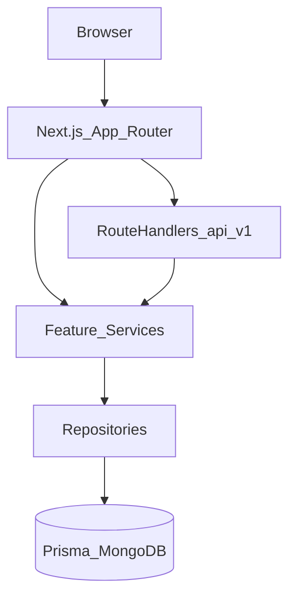
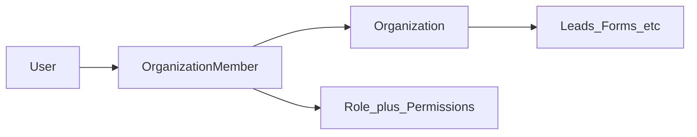

# SalesPilot

I built SalesPilot as a portfolio / take-home assignment for a job application.

I chose a **multi-tenant CRM** on purpose. A simple CRUD app would not have forced me to think about tenancy boundaries, auth flows, or authorization the way a real SaaS product does. My goal was to show how I approach architecture, authentication, authorization, maintainability, and decisions that keep a codebase scalable.

The domain is lead management: public forms create leads inside an organization, roles control who can see and update them, and activity/notifications keep a basic audit trail. The features matter, but they are the vehicle — the engineering is what I want reviewed.

| Layer | Choice |
| --- | --- |
| Framework | Next.js App Router (React Server Components by default) |
| Auth | Better Auth — email/password, verification, reset, Google social login |
| Data | Prisma ORM + MongoDB Atlas |
| Validation | Zod |
| UI | Tailwind + shadcn/ui (Radix) |
| Structure | Vertical slice modules under `src/modules/*` |

---

## Contents

1. [Why SalesPilot](#why-salespilot)
2. [Multi-tenant SaaS](#multi-tenant-saas)
3. [What’s built today](#whats-built-today)
   - [Authentication & account security](#authentication--account-security)
   - [Onboarding & organizations](#onboarding--organizations)
   - [Members, roles & permissions](#members-roles--permissions)
   - [Leads](#leads)
   - [Custom fields & public forms](#custom-fields--public-forms)
   - [Activity & notifications](#activity--notifications)
   - [Dashboard](#dashboard-live)
   - [Branding & storage](#branding--storage)
4. [Architecture](#architecture)
5. [How multi-tenancy works](#how-multi-tenancy-works)
6. [Extension: multi-organization per user](#extension-multi-organization-per-user)
7. [RBAC and role customization](#rbac-and-role-customization)
8. [Forms and lead customization](#forms-and-lead-customization)
9. [Security and operations](#security-and-operations)
10. [Roadmap / deliberate deferrals](#roadmap--deliberate-deferrals)
11. [Local development](#local-development)
12. [Project documentation](#project-documentation)
13. [Why this is a strong portfolio piece](#why-this-is-a-strong-assignment--portfolio-piece)

---

## Why SalesPilot

I wanted a problem space that felt like real SaaS work, not a tutorial app. Lead management gave me concrete flows — intake, assignment, visibility rules, forms — while still being small enough to finish carefully.

I structured the app as **one product, many tenants**: each organization is a hard boundary for data and access. That decision drove most of the interesting engineering.

The main capabilities I implemented around that model:

1. **Public intake** — shareable forms that create real CRM leads
2. **Ownership** — assign to managers and members with clear visibility rules
3. **Pipeline** — org-defined statuses, dashboard metrics, filters
4. **Accountability** — activity history and in-app notifications

---

## Multi-tenant SaaS

I treated multi-tenancy as a first-class requirement, not something to add after a single-workspace prototype.

- **Tenant = Organization.** Leads, forms, statuses, sources, custom fields, branding, activity, and notifications all belong to an org.
- **Users join tenants via membership.** A user authenticates once; access is resolved through `OrganizationMember` + role + permissions.
- **Isolation is enforced on the server.** Every business query is scoped by `organizationId`. Permissions gate *actions*; role scope gates *which rows* you can see.
- **Product UX today** resolves one active membership per session; the **schema already supports** a user belonging to many organizations — I left that path open so multi-workspace support would not require a tenancy rewrite.

Deep dive: [How multi-tenancy works](#how-multi-tenancy-works) · [`docs/23-organizations-multi-tenancy.md`](docs/23-organizations-multi-tenancy.md)

---

## What’s built today

This matches what I shipped against the project tracker (Plans 01–09, 11–12, 07, 14). I try to be clear about what is implemented versus what I only designed for later.

### Authentication & account security

I integrated Better Auth for both credential and social login. I wanted the auth surface to look like something you would actually ship, not a bare login form:

- **Email / password signup & login**
- **Email verification** — unverified users are steered to verify before using the app; resend support
- **Forgot password / reset password** — dedicated flows (`/forgot-password`, `/reset-password`)
- **Social login (Google OAuth)** — sign in with Google; account linking with same-email rules
- **Profile security** — change password; link / unlink Google from settings
- Session-aware marketing CTAs and authenticated dashboard shell

### Onboarding & organizations

- First-user **organization provisioning** (create tenant on signup path)
- **Invite tokens** to join an existing org (`/invite/[token]`); invite / resend / revoke
- Org settings (name) and member profile (avatar, phone, gender)

### Members, roles & permissions

- Default system roles: **Owner**, **Admin**, **Manager**, **Member**
- Central permission registry (`src/modules/permissions`)
- Role change and remove guards
- Action permissions *and* lead row visibility — I treat UI hiding as convenience, not the security boundary

### Leads

- Full create / edit / detail / list with search, filters, pagination, soft-delete
- **Role-scoped visibility** (enforced on the server):
  - Owner / Admin → all org leads
  - Manager → assigned as member **or** manager
  - Member → assigned as member only
- Dual assignment (manager + member); limited updates for members without assign permission
- Helpers: [`src/modules/leads/services/lead-access.ts`](src/modules/leads/services/lead-access.ts)

### Custom fields & public forms

- Org-defined custom fields (MVP types) with settings UI and lead value storage
- Lead form builder: core + custom fields, draft/publish, soft archive
- Public routes `/forms/[orgSlug]/[formSlug]` with optional Cloudflare Turnstile
- Per-form branding display (logo / name / both) gated on org logo

### Activity & notifications

- Append-only lead activity timeline on lead detail
- Side-effects on create / update / assign / delete / form submit
- In-app notifications (assign + status); header bell with polling; `/notifications` center

### Dashboard (live)

- Role-scoped metrics, pipeline by status, recent assigned leads, activity, notifications
- Date ranges: this week / this month / this year / custom (shared shadcn Calendar picker)
- Same picker reused on Leads filter sheet

### Branding & storage

- Org logo via S3 presigned PUT + CloudFront public URL
- Minimal storage module (logos/avatars); full lead attachments deferred

---

## Architecture

I organized the codebase as **vertical slice** feature modules. Each domain owns its UI, DTOs, services, and repositories. Shared infrastructure (auth context, Prisma, env, API envelope) stays thin on purpose — I did not want a large shared “core” that every feature has to fight with.



### Layering rules

| Layer | Responsibility |
| --- | --- |
| Pages / components | Presentation; Server Components by default |
| Services | Authz, business rules, orchestration |
| Repositories | Persistence only |
| DTOs + Zod | Request/response contracts — never raw Prisma models over the wire |

Key module roots: `src/modules/leads`, `lead-forms`, `custom-fields`, `organizations`, `permissions`, `activity`, `notifications`, `dashboard`, `branding`, `storage`, `settings`.

Deep dive: [`docs/02-architecture.md`](docs/02-architecture.md), [`docs/03-folder-structure.md`](docs/03-folder-structure.md).

---

## How multi-tenancy works

I scoped every business-critical record to an organization.



1. Authenticated requests resolve [`OrganizationContext`](src/modules/organizations/types/OrganizationContext.ts) (user + org + member + role + permissions)
2. Services require permissions via `Permissions.*` **and** apply row visibility (e.g. lead access helpers)
3. Repositories always filter by `organizationId` (and soft-delete where applicable)

| Today | Designed for |
| --- | --- |
| Session resolves the first active membership | User ↔ many `OrganizationMember` rows already in Prisma |
| No org switcher in the shell | Switcher + “active org” preference without remodeling tenants |

Docs: [`docs/23-organizations-multi-tenancy.md`](docs/23-organizations-multi-tenancy.md).

---

## Extension: multi-organization per user

I deliberately stopped short of building an org switcher in the UI. Moving from “one workspace in the session” to “many workspaces per login” should not require remodeling tenancy — that was the point of the membership model.

1. List memberships for the signed-in user (`organizationId`, role, org name/logo)
2. Persist active org (session claim, cookie, or `OrganizationMember` preference field)
3. Org switcher in the app shell that reloads `OrganizationContext`
4. Invite / onboarding already create memberships — reuse for additional orgs
5. Keep all queries keyed by the **active** `organizationId`

That is the usual next step for agencies or people who belong to more than one company.

---

## RBAC and role customization

I kept permissions **data-driven** so role sets could change without rewriting business logic:

- Canonical names in [`src/modules/permissions/constants/permissions.ts`](src/modules/permissions/constants/permissions.ts)
- Roles per org with `RolePermission` join rows
- Default Owner / Admin / Manager / Member seeds; `pnpm roles:sync` repairs permission sets after code changes

**Already flexible**

- Action gates (`lead.assign`, `form.publish`, `branding.update`, …)
- Lead **row** scope by role (see above)

**Ready to extend**

| Idea | How it plugs in |
| --- | --- |
| Custom roles | New `Role` rows + permission matrix UI (settings) |
| Role-specific form editors | Gate form field configs by permission or role allowlists |
| Field-level ACL | Custom-field metadata + service checks on read/write |
| Manager of team X only | Extend visibility helpers beyond “assigned to me” |

---

## Forms and lead customization

**Shipped**

- Custom field definitions per org
- Form field config (core + custom), publish lifecycle, public submit → lead + submission + activity
- Branding on public forms (`LOGO` / `NAME` / `BOTH`)

**Good-to-have extensions**

- Conditional fields / branching
- Per-role or per-team form layouts
- Embeddable form SDK / iframe with org theme tokens
- Thank-you page / webhook outbound (Zapier-style)
- A/B form variants and conversion analytics on the dashboard

---

## Security and operations

- **Server is source of truth** — Zod validation, Better Auth sessions, permission + visibility checks
- **Auth surface** — email verification, password reset, Google OAuth with linking rules
- **Env** validated via [`src/server/env.ts`](src/server/env.ts) (no silent missing secrets)
- **API envelope** — consistent success/error shapes ([`docs/24-api-standards.md`](docs/24-api-standards.md))
- **Uploads** — browser → S3 presigned PUT; app stores CloudFront URLs only; modules never talk to S3 ad hoc
- **Public forms** — optional Turnstile when configured
- **Deploy note (Vercel + Atlas)** — serverless egress IPs are not static; Atlas Network Access typically needs `0.0.0.0/0` (or Vercel Static IPs add-on) plus a strong DB user password

---

## Roadmap / deliberate deferrals

| Area | Status |
| --- | --- |
| Global search | Skipped for MVP — list filters cover leads/forms |
| Lead file attachments | Deferred (Plan 13); storage slice reused for logos/avatars |
| Email / push notifications | In-app only today |
| Billing / plans | Not started |
| White-label / remove SalesPilot chrome | Documented as future |
| Real-time websockets | Polling for notifications by design |

I tracked deferred work in [`PROJECT_TRACKER.md`](PROJECT_TRACKER.md). Product docs live under [`docs/`](docs/).

---

## Local development

**Requirements:** Node 20+, pnpm, MongoDB (local or Atlas).

```bash
pnpm install
cp .env.example .env   # fill DATABASE_URL, Better Auth, optional Google/SMTP/S3/Turnstile
pnpm exec prisma generate
pnpm dev
```

Useful scripts:

```bash
pnpm test           # Vitest unit tests
pnpm lint           # Biome
pnpm roles:sync     # Re-apply default role permission sets to existing orgs
pnpm build          # prisma generate && next build
```

App URL defaults to `http://localhost:3000` (`NEXT_PUBLIC_APP_URL` / `BETTER_AUTH_URL`).

---

## Project documentation

I kept the repo **docs-driven** so decisions stay written down. Before changing a domain, start with:

1. [`docs/00-project-overview.md`](docs/00-project-overview.md)
2. [`docs/02-architecture.md`](docs/02-architecture.md)
3. [`docs/03-folder-structure.md`](docs/03-folder-structure.md)
4. [`docs/04-tech-stack.md`](docs/04-tech-stack.md)
5. Feature docs (leads, forms, dashboard, tenancy, API standards, …)
6. [`AGENTS.md`](AGENTS.md) + [`PROJECT_TRACKER.md`](PROJECT_TRACKER.md) for delivery state

---

## Why this is a strong assignment / portfolio piece

If you are reviewing this repo for a hiring process, this is what I hope you look at:

- **Architecture** — vertical slices, service/repository split, DTOs instead of leaking Prisma models
- **Multi-tenancy** — org-scoped data, memberships, and isolation checked on the server
- **RBAC** — permission gates plus lead row visibility, not UI-only checks
- **Better Auth integration** — email/password, verification, reset password, Google social login, account linking
- **Modular design** — feature modules you can open and reason about in isolation
- **Maintainability** — typed contracts, Zod, env validation, tests, documented deferrals
- **Production-oriented decisions** — presigned uploads, Turnstile when configured, honest scope where I stopped short

I shipped an end-to-end surface (marketing, auth, CRM, forms, dashboard, settings, branding) so the architecture has somewhere real to live. Feature count was never the main score I was optimizing for.

---

## License / assignment note

I built this as a take-home for DIGITAL HEROES job application. The objective was to demonstrate engineering ability — architecture, tenancy, auth, authorization, and how I organize a Next.js codebase. Feature completeness was intentionally secondary to software design.
