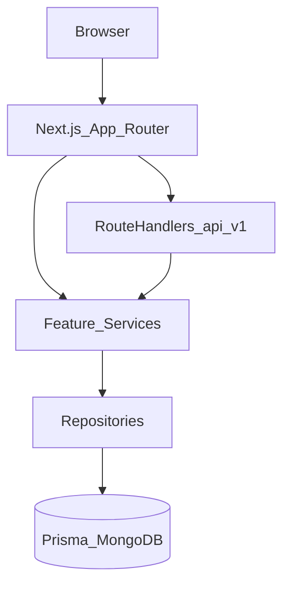
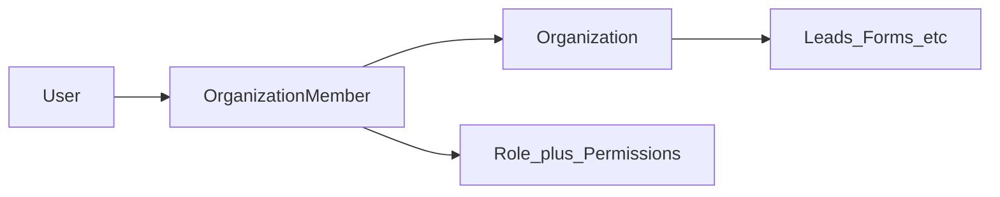

# SalesPilot

**A production-minded, multi-tenant lead management SaaS** — capture leads from branded public forms, assign them through a role-aware pipeline, and keep the team aligned with activity and notifications.

Built as a full-stack assignment to demonstrate **SaaS architecture**, **secure multi-tenancy**, **RBAC**, and **maintainable Next.js engineering** — not a throwaway demo.

| Layer | Choice |
| --- | --- |
| Framework | Next.js App Router (React Server Components by default) |
| Auth | Better Auth (email/password + Google OAuth) |
| Data | Prisma ORM + MongoDB Atlas |
| Validation | Zod |
| UI | Tailwind + shadcn/ui (Radix) |
| Structure | Vertical slice modules under `src/modules/*` |

---

## Why SalesPilot

Small and mid-size sales teams still lose leads in spreadsheets, shared inboxes, and one-off form tools. SalesPilot gives an organization:

1. **Public intake** — shareable forms that create real CRM leads
2. **Ownership** — assign to managers and members with clear visibility rules
3. **Pipeline** — org-defined statuses, dashboard metrics, filters
4. **Accountability** — activity history and in-app notifications

The product is **organization-centric**: every business record belongs to an org. The current product UX resolves **one active membership** per session, while the data model already supports **users belonging to many organizations** — a deliberate path to multi-workspace SaaS without a rewrite.

---

## What’s built today

Aligned with the project tracker (Plans 01–09, 11–12, 07, 14). Honest scope: what ships vs what is designed-for extension.

### Authentication & onboarding

- Email/password with verification and password reset
- Google OAuth (account linking with same-email rules)
- First-user org provisioning; invite tokens to join an existing org
- Session-aware marketing and dashboard shells

### Members, roles & permissions

- Default system roles: **Owner**, **Admin**, **Manager**, **Member**
- Central permission registry (`src/modules/permissions`)
- Invite / resend / revoke; role change and remove guards
- Org settings (name) and profile settings (avatar, phone, gender, password, Google link/unlink)

### Leads

- Full create / edit / detail / list with search, filters, pagination, soft-delete
- **Role-scoped visibility** (enforced on the server, not only in the UI):
  - Owner / Admin → all org leads
  - Manager → assigned as member **or** manager
  - Member → assigned as member only
- Dual assignment (manager + member); limited updates for members without assign permission
- Helpers live in [`src/modules/leads/services/lead-access.ts`](src/modules/leads/services/lead-access.ts)

### Custom fields & public forms

- Org-defined custom fields (MVP types) with settings UI and lead value storage
- Lead form builder: core + custom fields, draft/publish, soft archive
- Public routes `/forms/[orgSlug]/[formSlug]` with optional Cloudflare Turnstile
- Per-form branding display (logo / name / both) gated on org logo

### Activity & notifications

- Append-only lead activity timeline on lead detail
- Side-effects on create / update / assign / delete / form submit
- In-app notifications (assign + status); header bell with polling; `/notifications` center

### Dashboard (live)

- Role-scoped metrics, pipeline by status, recent assigned leads, activity, notifications
- Date ranges: this week / this month / this year / custom (shared shadcn Calendar picker)
- Same picker reused on Leads filter sheet

### Branding & storage

- Org logo via S3 presigned PUT + CloudFront public URL
- Minimal storage module (logos/avatars); full lead attachments deferred

---

## Architecture

SalesPilot uses **vertical slice** feature modules. Business domains own UI, DTOs, services, and repositories. Shared infrastructure (auth context, Prisma, env, API envelope) stays thin.



### Layering rules

| Layer | Responsibility |
| --- | --- |
| Pages / components | Presentation; Server Components by default |
| Services | Authz, business rules, orchestration |
| Repositories | Persistence only |
| DTOs + Zod | Request/response contracts — never raw Prisma models over the wire |

Key module roots: `src/modules/leads`, `lead-forms`, `custom-fields`, `organizations`, `permissions`, `activity`, `notifications`, `dashboard`, `branding`, `storage`, `settings`.

Deep dive: [`docs/02-architecture.md`](docs/02-architecture.md), [`docs/03-folder-structure.md`](docs/03-folder-structure.md).

---

## Multi-tenancy

**Everything business-critical is organization-scoped.** Leads, forms, statuses, sources, custom fields, branding, activity, and notifications all hang off an `Organization`.



### How isolation works in code

1. Authenticated requests resolve [`OrganizationContext`](src/modules/organizations/types/OrganizationContext.ts) (user + org + member + role + permissions)
2. Services require permissions via `Permissions.*` **and** apply row visibility (e.g. lead access helpers)
3. Repositories always filter by `organizationId` (and soft-delete where applicable)

UI hiding is never the security boundary — **server checks are mandatory**.

Docs: [`docs/23-organizations-multi-tenancy.md`](docs/23-organizations-multi-tenancy.md).

### Current product vs schema

| Today | Designed for |
| --- | --- |
| Session resolves the first active membership | User ↔ many `OrganizationMember` rows already in Prisma |
| No org switcher in the shell | Switcher + “active org” preference without remodeling tenants |

---

## Extension: multi-organization per user

Moving from “one workspace in the UI” to “many workspaces per login” does **not** require a tenancy rewrite.

**Concrete next steps**

1. List memberships for the signed-in user (`organizationId`, role, org name/logo)
2. Persist active org (session claim, cookie, or `OrganizationMember` preference field)
3. Org switcher in the app shell that reloads `OrganizationContext`
4. Invite / onboarding already create memberships — reuse for additional orgs
5. Keep all queries keyed by the **active** `organizationId`

This is the natural SaaS growth path (agencies, consultants, users in multiple companies).

---

## RBAC and role customization

Permissions are **data-driven**:

- Canonical names in [`src/modules/permissions/constants/permissions.ts`](src/modules/permissions/constants/permissions.ts)
- Roles per org with `RolePermission` join rows
- Default Owner / Admin / Manager / Member seeds; `pnpm roles:sync` repairs permission sets after code changes

**Already flexible**

- Action gates (`lead.assign`, `form.publish`, `branding.update`, …)
- Lead **row** scope by role (see above)

**Ready to extend**

| Idea | How it plugs in |
| --- | --- |
| Custom roles | New `Role` rows + permission matrix UI (settings) |
| Role-specific form editors | Gate form field configs by permission or role allowlists |
| Field-level ACL | Custom-field metadata + service checks on read/write |
| Manager of team X only | Extend visibility helpers beyond “assigned to me” |

---

## Forms and lead customization

**Shipped**

- Custom field definitions per org
- Form field config (core + custom), publish lifecycle, public submit → lead + submission + activity
- Branding on public forms (`LOGO` / `NAME` / `BOTH`)

**Good-to-have extensions**

- Conditional fields / branching
- Per-role or per-team form layouts
- Embeddable form SDK / iframe with org theme tokens
- Thank-you page / webhook outbound (Zapier-style)
- A/B form variants and conversion analytics on the dashboard

---

## Security and operations

- **Server is source of truth** — Zod validation, Better Auth sessions, permission + visibility checks
- **Env** validated via [`src/server/env.ts`](src/server/env.ts) (no silent missing secrets)
- **API envelope** — consistent success/error shapes ([`docs/24-api-standards.md`](docs/24-api-standards.md))
- **Uploads** — browser → S3 presigned PUT; app stores CloudFront URLs only; modules never talk to S3 ad hoc
- **Public forms** — optional Turnstile when configured
- **Deploy note (Vercel + Atlas)** — serverless egress IPs are not static; Atlas Network Access typically needs `0.0.0.0/0` (or Vercel Static IPs add-on) plus a strong DB user password

---

## Roadmap / deliberate deferrals

| Area | Status |
| --- | --- |
| Global search | Skipped for MVP — list filters cover leads/forms |
| Lead file attachments | Deferred (Plan 13); storage slice reused for logos/avatars |
| Email / push notifications | In-app only today |
| Billing / plans | Not started |
| White-label / remove SalesPilot chrome | Documented as future |
| Real-time websockets | Polling for notifications by design |

Tracker: [`PROJECT_TRACKER.md`](PROJECT_TRACKER.md). Product docs under [`docs/`](docs/).

---

## Local development

**Requirements:** Node 20+, pnpm, MongoDB (local or Atlas).

```bash
pnpm install
cp .env.example .env   # fill DATABASE_URL, Better Auth, optional Google/SMTP/S3/Turnstile
pnpm exec prisma generate
pnpm dev
```

Useful scripts:

```bash
pnpm test           # Vitest unit tests
pnpm lint           # Biome
pnpm roles:sync     # Re-apply default role permission sets to existing orgs
pnpm build          # prisma generate && next build
```

App URL defaults to `http://localhost:3000` (`NEXT_PUBLIC_APP_URL` / `BETTER_AUTH_URL`).

---

## Project documentation

This repo is **docs-driven**. Before changing a domain, start with:

1. [`docs/00-project-overview.md`](docs/00-project-overview.md)
2. [`docs/02-architecture.md`](docs/02-architecture.md)
3. [`docs/03-folder-structure.md`](docs/03-folder-structure.md)
4. [`docs/04-tech-stack.md`](docs/04-tech-stack.md)
5. Feature docs (leads, forms, dashboard, tenancy, API standards, …)
6. [`AGENTS.md`](AGENTS.md) + [`PROJECT_TRACKER.md`](PROJECT_TRACKER.md) for delivery state

---

## Why this is a strong assignment / portfolio piece

- **SaaS-shaped tenancy** from day one — not a single-tenant CRUD app with “org_id” bolted on later
- **Real authorization** — permissions *and* row scope, tested helpers, no “hide the button” security
- **Vertical slices** — features are findable and reviewable as units
- **End-to-end product surface** — marketing, auth, CRM, public forms, dashboard, settings, branding
- **Operational honesty** — deferred work is tracked; sample data was replaced when backends landed
- **Engineering hygiene** — typed DTOs, Zod, Prisma, Biome, Vitest, env validation, incremental plans

---

## License / assignment note

Built as a take-home / internship-style engineering assignment for SalesPilot. Stack and architecture choices prioritize **clarity, security, and extendability** suitable for a commercial multi-tenant CRM.
